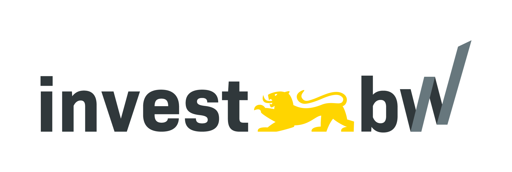

# [Kollani](https://ai.hdm-stuttgart.de/research/kollani/) Motion Lab (MoLab)


> A toolbox for **human motion generation and inbetweening**, developed during the [Kollani](https://ai.hdm-stuttgart.de/research/kollani/) project.

- **Github repository**: <https://github.com/JasonNero/MoLab/>
- **Documentation** <https://JasonNero.github.io/MoLab/>

<div align="center">
  
</div>

## Features

- **Text To Motion**: Describe the motion you want to see
- **In-Betweening**: Input your keyposes and let AI fill the gaps
- **Motion Composition**: Compose sequences and generate transitions

## Getting started

To get started with MoLab, please take a look at the [installation guide](https://jasonnero.github.io/MoLab/getting-started/installation/).
The [first steps](https://jasonnero.github.io/MoLab/getting-started/first-steps/) page will guide you through the process of starting the components and running your first inference.

## Folder Structure

```
MoLab/
├── backend/            # FastAPI endpoint for inference
├── models/condmdi/     # CondMDI fork with new features and improvements
│   └── README.md       # CondMDI model description and usage instructions
├── frontend/           # Godot User Interface for MoLab Sequencer
├── dcc/                # DCC plugins (Maya, Blender, etc.)
├── docs/               # Documentation for the project
├── Justfile            # Automate build/test tasks across components
└── README.md           # Project description and setup instructions
```

## Contributing

Pull requests are welcome. For major changes, please open an issue first
to discuss what you would like to change.

## Funding

**Kollani** represents a collaborative innovation project by [SERU Animation GmbH](https://www.seru-animation.com), [RnDeep GmbH](https://rndeep.com/), and the [Institute for Applied Artificial Intelligence](https://ai.hdm-stuttgart.de) at the [Hochschule der Medien Stuttgart](https://www.hdm-stuttgart.de).

The project is funded by the [Ministerium für Wirtschaft, Arbeit und Tourismus Baden-Württemberg](https://wm.baden-wuerttemberg.de/de/startseite) as part of an [investBW](https://invest-bw.de) initiative.

<p align="center">
  
   
</p>

## Acknowledgements

We would like to thank the following contributors/projects for the great foundation that we build upon:
[diffusion-motion-inbetweening](https://github.com/setarehc/diffusion-motion-inbetweening), [GMD](https://github.com/korrawe/guided-motion-diffusion), [MDM](https://github.com/GuyTevet/motion-diffusion-model), [guided-diffusion](https://github.com/openai/guided-diffusion), [MotionCLIP](https://github.com/GuyTevet/MotionCLIP), [text-to-motion](https://github.com/EricGuo5513/text-to-motion), [actor](https://github.com/Mathux/ACTOR), [joints2smpl](https://github.com/wangsen1312/joints2smpl), [MoDi](https://github.com/sigal-raab/MoDi).

## License

This code is distributed under an [MIT LICENSE](LICENSE).

Note that our code depends on other libraries and pretrained models, including CondMDI, CLIP, SMPL, SMPL-X, PyTorch3D, and uses datasets that each have their own respective licenses that must also be followed.

> [!WARNING]
> By using the pre-trained models of diffusion-motion-inbetweening (CondMDI), you agree to adhere to the licenses of the respective model checkpoints and datasets.
> HumanML3D is non-commercial and for research purposes only due to its use of the AMASS dataset. As a result, this project follows the same licensing restrictions and is limited to non-commercial and research purposes only.
> In order to use the models for commercial purposes, you must train your own models on a dataset that you have the rights to use commercially.
