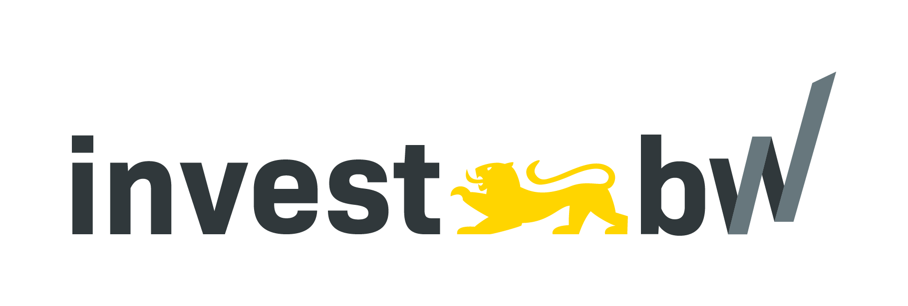

# [Kollani](https://ai.hdm-stuttgart.de/research/kollani/) Motion Lab (MoLab)


> A toolbox for **human motion generation and inbetweening**, developed during the [Kollani](https://ai.hdm-stuttgart.de/research/kollani/) project.

- **Github repository**: <https://github.com/JasonNero/MoLab/>
- **Documentation** <https://JasonNero.github.io/MoLab/>

<p align="center">
  
</p>


## Features

- **Text To Motion**: Describe the motion you want to see
- **In-Betweening**: Input your keyposes and let AI fill the gaps
- **Motion Composition**: Compose sequences and generate transitions

## Overview

```
MoLab/
├── backend/            # FastAPI endpoint for inference
├── models/condmdi/     # CondMDI fork with new features and improvements
│   └── README.md       # CondMDI model description and usage instructions
├── frontend/           # Godot User Interface for MoLab Sequencer
├── experiments/        # Notebooks/scripts for experiments and demos
├── dcc/                # DCC plugins (Maya, Blender, etc.)
├── tests/              # System-level tests involving all components
├── docs/               # Documentation for the project
├── Makefile            # Automate build/test tasks across components
└── README.md           # Project description and setup instructions
```

## Getting started

Follow the steps below to get everything up and running.

### Prerequisites

Before you begin, ensure you have the following installed:

- [**uv**](https://docs.astral.sh/uv/) (Python Package Manager)
- [**Godot Engine 4**](https://godotengine.org) (For the Frontend)

### Installation

To install the project, follow these steps:

1. Clone the repository and navigate to the project root directory
2. Run `make install` to setup the python environments
3. Run `make download` to download the required model checkpoints.

### Usage

1. Run `make run-backend` to start the FastAPI server
2. Run `make run-worker` to start an Inference worker
3. Connect to the backend using the Frontend or DCC Plugin

#### Using the Godot App / Frontend

1. First download the ["Akai e espiritu" model from Mixamo](https://www.mixamo.com/#/?page=1&query=akai&type=Character) and save it as `frontend/res/models/akai_e_espiritu.fbx`
2. Open and build the Godot project in `frontend`
3. Run the project and check log messages for a successful backend connection

For more details please refer to the [documentation](https://JasonNero.github.io/MoLab/).

#### Using the DCC Plugin

See `dcc/infer_from_dcc.py` for an example of how to connect to the backend and infer from the Maya Script Editor.
Make sure to adapt the backend URI and add the repo source folder to the `sys.path`.

For more details please refer to the [documentation](https://JasonNero.github.io/MoLab/).

> [!WARNING]
> Currently only Maya is supported.
> The Blender script is out-of-date and incomplete, feel free to contribute.

## Deploy with Docker

Instead of running backend and worker locally, you can also deploy them using Docker:

```bash
docker-compose up
```

This command automatically sets up a container for the backend and worker components, setting up the Python environment (see the components `Dockerfile` for details).
It then spins up the backend server as well as two worker instances connected via a bridge network.
Clients can then connect to the exposed port 8000.

Optionally, the Godot Frontend can be served as well, but only with reduced IO features.
For this, you need to build/export it as HTML first and uncomment the `frontend` segment of the `docker-compose.yaml` file.

## Contributing

Pull requests are welcome. For major changes, please open an issue first
to discuss what you would like to change.

## Funding

**Kollani** represents a collaborative innovation project by [SERU Animation GmbH](https://www.seru-animation.com), [RnDeep GmbH](https://rndeep.com/), and the [Institute for Applied Artificial Intelligence](https://ai.hdm-stuttgart.de) at the [Hochschule der Medien Stuttgart](https://www.hdm-stuttgart.de).

The project is funded by the [Ministerium für Wirtschaft, Arbeit und Tourismus Baden-Württemberg](https://wm.baden-wuerttemberg.de/de/startseite) as part of an [investBW](https://invest-bw.de) initiative.

<p align="center">
  
   
</p>

## Acknowledgements

We would like to thank the following contributors/projects for the great foundation that we build upon:
[diffusion-motion-inbetweening](https://github.com/setarehc/diffusion-motion-inbetweening), [GMD](https://github.com/korrawe/guided-motion-diffusion), [MDM](https://github.com/GuyTevet/motion-diffusion-model), [guided-diffusion](https://github.com/openai/guided-diffusion), [MotionCLIP](https://github.com/GuyTevet/MotionCLIP), [text-to-motion](https://github.com/EricGuo5513/text-to-motion), [actor](https://github.com/Mathux/ACTOR), [joints2smpl](https://github.com/wangsen1312/joints2smpl), [MoDi](https://github.com/sigal-raab/MoDi).

## License

<!-- TODO: Explain sub-licenses, especially CondMDI model -->

This code is distributed under an [MIT LICENSE](LICENSE).

Note that our code depends on other libraries, including CLIP, SMPL, SMPL-X, PyTorch3D, and uses datasets that each have their own respective licenses that must also be followed.
