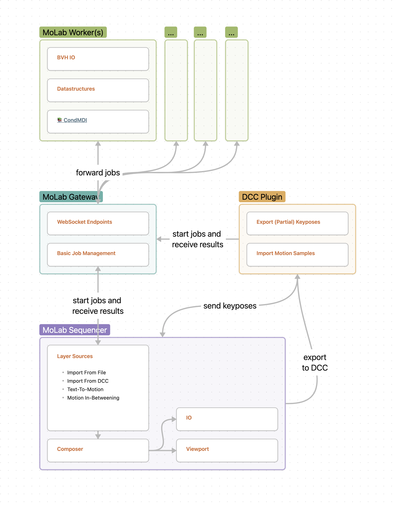

# MoLab Concept and Architecture

## Folder Structure

Each component of MoLab is located in a separate directory outlined below.
The `Justfile` in the root directory provides a way to automate build and test tasks across components.
The terms backend and gateway are used interchangeably in the context of MoLab.

```console
MoLab/
├── backend/            # FastAPI endpoint for inference
├── models/condmdi/     # CondMDI fork with new features and improvements
│   └── README.md       # CondMDI model description and usage instructions
├── frontend/           # Godot User Interface for MoLab Sequencer
├── dcc/                # DCC plugins (Maya, Blender, etc.)
├── docs/               # Documentation for the project
├── Justfile            # Automate build/test tasks across components
└── README.md           # Project description and setup instructions
```

## Overview

Conceptually, MoLab consists of these four components: the **MoLab Sequencer**, **Gateway**, **Worker** and **DCC Plugin**.

The **Worker** contains the machine learning model and is responsible for generating motion sequences based on text descriptions and the **Gateway** is the interface between the worker and the client. It is responsible for distributing the inference requests to a free worker instance and returning the results.

Currently, there are two available clients: the **DCC Plugin** and the **MoLab Sequencer**. Both allow the user to send inference requests and receive the generated motion sequences but have different use-cases. The former is a plugin for the 3D software Autodesk Maya and allows a direct integration into an animators workflow.
The latter is a standalone application aimed at higher-level use-cases like pre-production and provides a timeline-based user interface for editing and composing motion sequences.


