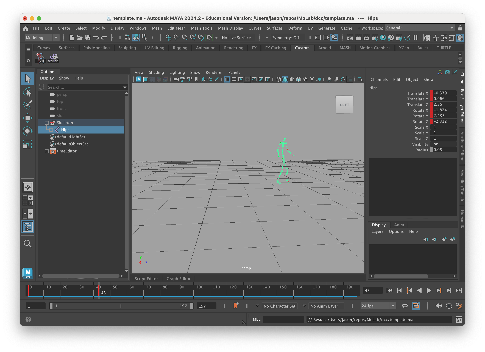
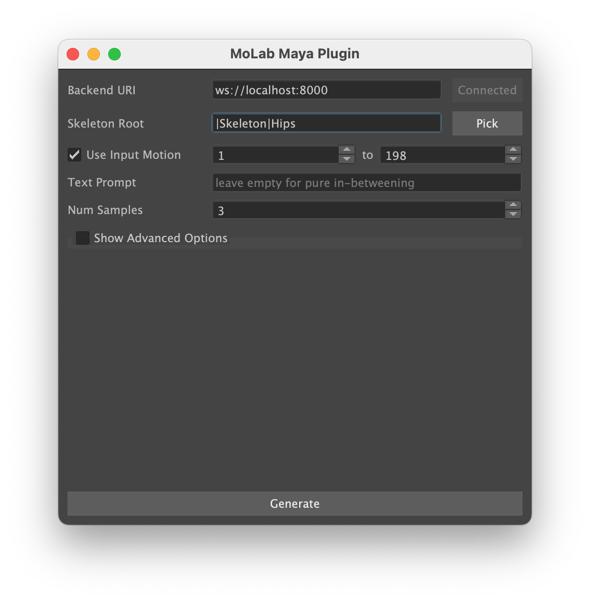
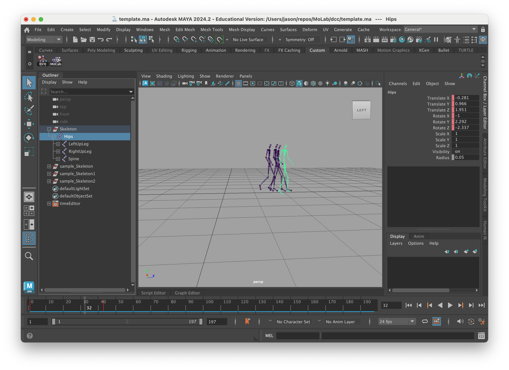

# First Steps

After [installing MoLab](installation.md), follow the steps below to get everything up and running.

## Starting the Backend and Worker

First start the backend server:

```console
$ just run-backend
🚀 Running the backend
...
```

Then start a worker and wait for it to connect to the backend:

```console
$ just run-worker
🚀 Running the worker
...
```

Now everything is set up and you can connect to the backend using any of the clients below.

## Starting a Client

Currently MoLab supports these clients with different use cases:

- **MoLab Sequencer**: The frontend built with Godot
    - Aimed at producers and animators
    - Generate animations from text descriptions
    - Layer-based editing and transitions
- **MoLab Maya Plugin**: Integration for Autodesk Maya
    - Aimed at animators
    - Infer from the Maya Script Editor
    - Feed key poses and generate in-betweens
- **MoLab API**: Directly connect to the backend
    - Aimed at developers
    - Use the API to interact with the backend

### MoLab Sequencer

Either start the Godot project from the editor or export the project to a standalone application, as described in the [installation guide](installation.md).
You will be greeted with an empty composition and in the log output you should see a successful connection to the backend.


You are now ready to start generating and layering animations.
First add a new "ML Source" via the "Add New Source" Button. Then select the source and type a description into the "Prompt Text" field and hit Enter.
Finally you can press the "Process" button.

This process will take from 20s to 2min, depending on your available GPU resources. If you leave the text prompt empty, the inference time will be halved. Afterwards you can switch between the generated samples and play them back.


You can also supply input motion for the generation process by using the "In Offset" or "Out Offset" properties. The model will then try to fill the gaps according to the input motion and the prompt text.


Now you know the basics of the MoLab Sequencer and can start generating and layering animations.
For more details and explanations, see the [MoLab Sequencer documentation](../usage/sequencer.md).

### MoLab Maya Plugin

First open the `dcc/template.ma` scene in Maya to start with a compatible skeleton and an animation with two keyframes as example poses.



Then load the MoLab Maya Plugin by pasting the contents of `dcc/maya_shelf_script.py` into the Maya Script Editor and running it.
This will open up a new window with the MoLab Maya Plugin.



First supply a Backend URI, which should be `ws://localhost:8000` if you are running the backend locally.
Then press the "Connect" Button to establish a connection to the backend.
The button should change to "Connected" if the connection was successful.
Now select the characters `Hips` joint in Maya and press the "Pick" Button in the plugin. This will validate the skeleton and set up the plugin for inference.
Next, adjust the input range to your desired keyframes and optionally add a prompt text.
In this example we leave the prompt text empty and do pure in-betweening.

Finally, press the "Generate" Button on the bottom and wait for the inference to finish. Again, this can take from 20s to 2min, depending on your available GPU resources. If you leave the text prompt empty, the inference time will be halved.
After a while you should see a duplicated character per sample and can now inspect the generated animations.



For further details on how to use the MoLab Maya Plugin, see the [MoLab Maya Plugin documentation](../usage/maya-plugin.md).

## Next Steps

Now that you have everything set up, you can start using MoLab to generate animations.
For more detailed information on how to use the clients, refer to their respective documentations: [MoLab Sequencer](../usage/sequencer.md), [MoLab Maya Plugin](../usage/maya-plugin.md) or [MoLab API](../api-reference/api-example.md).
