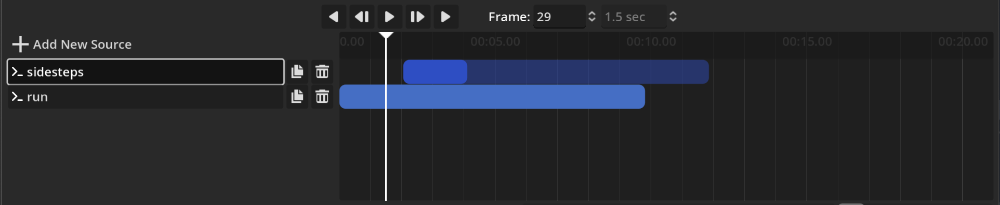

# Using the MoLab Sequencer

## Composition and Sources

A Composition in MoLab Sequencer is a collection of Motion Sources, either loaded from file or generated by the CondMDI model.
Using the well known shortcuts ++ctrl+o++ and ++ctrl+s++, you can open and save compositions respectively. To start with a new, empty composition, use ++ctrl+n++.

Every source has a in-point and out-point that define the total length and position in the timeline.
Furthermore each source has a in-offset and out-offset that define the start and end of the motion within the source.

When layering sources, only the inner range of a source is applied, while the outer range is ignored.

The "Affects Post-Range" option defines whether underlying sources are affected of root motion changes in the case of a source that ends before the underlying source. Disabling this option will result in a snap-back to the original position of the underlying source, while enabling it will result in a smooth transition.

Currently, there are two types of sources available:

- [File Source](#file-source): A motion source loaded from a file.
- [ML Source](#ml-source): A motion source generated by the CondMDI model.

### File Source

When using the File Source, the user can select a file from the file dialog and the source will be loaded into the timeline.

> [!NOTE]
> The BVH importer has been disabled in the current version due to rig incompatibilities. We are working on a solution to enable this feature in the future. Please use glTF files for now.

### ML Source

When adding a ML Source, a source of 197 frames is added to the timeline (this is the maximum sequence length for CondMDI).
This source can optionally be provided with a description of the desired motion in the "Prompt Text" field.

In contrast to the usual source, the in-offset and out-offset properties allow you to specify the ranges that should be used as input/context for the generation process and which range should be generated:

- The inner range is the range that will be generated by the model
- The outer ranges are the context for the generation process.

Finally, upon hitting the "Process" button in the properties panel, the source is sent to the backend for generation.

> [!NOTE]
> Currently there is no progress feedback in the UI for the generation process, so please be patient and check the worker logs for progress.
> Once the result is ready, the source will be deselected as an indicator.

After the generation process is finished, the user can select one of the generated motions in the "Selected Sample" Dropdown and play it back in the timeline.

## Using the Timeline

The top of the timeline contains playback controls and the current playback time or frame.
Below that is the timeline itself, where sources can be added and arranged.
You can drag sources around in the timeline to change their position or move their in/out points as well as in/out offsets.

Using the scroll wheel, you can move the timeline horizontally to navigate.
To zoom in and out, hold the ++shift++ key and use the scroll wheel.

You can also use ++alt+space++ to play and pause the timeline as well as ++alt+left++ to jump to the previous frame or the next frame using ++alt+right++.

A different way to change the current time is to use the time input field at the top of the timeline or drag the playback head to the desired position.
To grab the playback head, click and drag the line **below** the last source in the timeline. (This is a known issue and will be fixed in a future release.)

## Export to glTF 2.0

After you are satisfied with your composition, you can export it to a glTF file by using the ++ctrl+e++ shortcut.
This will open a file dialog where you can select the location and name of the file to save.
The resulting glTF file will contain the character and the composition as a single animation clip.

